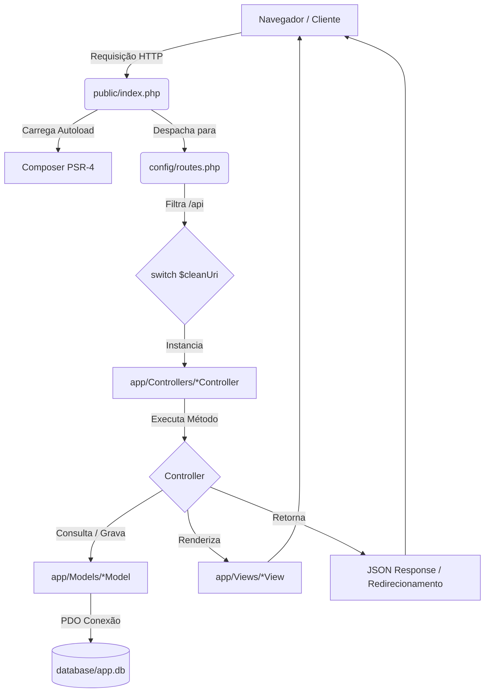

# Sites da Fábrica — Guia de Arquitetura

Este documento fornece uma visão geral detalhada da arquitetura técnica do projeto **Sites da Fábrica**. Ele serve como um manual de bordo para desenvolvedores e assistentes de IA compreenderem rapidamente os fluxos, padrões de código e estruturas de dados do sistema.

---

## 1. Visão Geral da Tecnologia
O projeto é uma plataforma SaaS (Software as a Service) para criação e gerenciamento de sites corporativos focados em PMEs (Pequenas e Médias Empresas).
* **Linguagem Principal:** PHP (>= 8.0) sem frameworks pesados (como Laravel ou Symfony).
* **Banco de Dados:** SQLite em desenvolvimento (`database/app.db`) e suporte opcional ao MySQL em produção (gerenciado por migrations agnósticas a driver PDO).
* **Frontend:** HTML5, CSS3 e Javascript puro (Vanilla) com manipulação de DOM nativa e requisições assíncronas (Fetch API).
* **Ponto de Entrada:** `public/index.php`.

---

## 2. Ciclo de Vida de uma Requisição (Request Lifecycle)

Abaixo está o fluxo percorrido por qualquer requisição HTTP na plataforma:



1. **Entrada:** Todas as requisições web são direcionadas para `public/index.php` (configurado via `.htaccess` para Apache ou roteamento de servidor embutido do PHP).
2. **Autoload:** O PHP carrega as dependências e o PSR-4 autoloading baseado no namespace `App\\` definido em `composer.json`.
3. **Roteamento:** A requisição é encaminhada para `config/routes.php`. O roteador limpa a query string, remove `/api` se presente (definindo `$isApi = true`), e avalia o path em um `switch`.
4. **Controlador:** O controlador correspondente é instanciado e o método correto é executado.
5. **Modelos e Views:** O controlador invoca modelos em `app/Models` para interagir com o banco de dados (SQLite via PDO) e inclui os arquivos PHP em `app/Views` para renderização visual do HTML, ou retorna um JSON.

---

## 3. Estrutura de Pastas e Componentes

```
📂 sitesdafabrica
├── 📂 app                  # Código principal do MVC
│   ├── 📂 Controllers      # Controladores HTTP (tratam requests e responses)
│   ├── 📂 Models           # Modelos de dados (interagem com PDO SQLite/MySQL)
│   ├── 📂 Views            # Templates PHP/HTML de visualização
│   └── 📂 helpers          # Helpers e funções utilitárias auxiliares
├── 📂 config               # Arquivos de configuração centrais
│   ├── database.php        # Inicialização do PDO SQLite e tratamento de Foreign Keys
│   └── routes.php          # Roteamento manual baseado em switch
├── 📂 database             # Scripts de banco de dados e controle de esquema
│   ├── 📂 migrations       # Arquivos de migração SQL
│   ├── 📂 seeders          # Populadores do banco (dados iniciais)
│   ├── Migrator.php        # Classe core de processamento das migrations
│   ├── app.db              # Banco de dados SQLite local (ignorado no git)
│   └── migrate.php         # Script CLI para rodar migrações, rollbacks e seeds
├── 📂 public               # Diretório público exposto ao servidor web
│   ├── 📂 assets           # Arquivos estáticos (css, js, img)
│   ├── index.php           # Arquivo ponto de entrada da aplicação
│   └── templates           # Diretório de templates gerados para os projetos
└── composer.json           # Dependências e scripts atalhos (composer run ...)
```

---

## 4. Esquema e Tabelas do Banco de Dados

O banco de dados SQLite principal está localizado em `database/app.db`. O esquema é composto pelas seguintes tabelas:

1. **`users`**: Usuários da plataforma.
   * `id` (INTEGER PRIMARY KEY)
   * `name` (TEXT)
   * `email` (TEXT UNIQUE)
   * `password` (TEXT - hash de senha)
   * `role` (TEXT CHECK(role IN ('user', 'admin')))
   * `status` (TEXT CHECK(status IN ('active', 'inactive', 'suspended')))
   * `domains_used`, `subdomains_used` (INTEGER)
   * Timestamps: `created_at`, `updated_at`, `deleted_at`

2. **`plans`**: Planos SaaS disponíveis para assinatura.
   * `id` (INTEGER PRIMARY KEY)
   * `name` (TEXT UNIQUE), `description` (TEXT), `price` (DECIMAL/REAL)
   * Limites: `max_projects`, `max_storage_mb`, `max_downloads`, `max_domains`, `max_subdomains`
   * Flags: `is_featured`, `is_visible`, `display_order`, `status`

3. **`subscriptions`**: Vinculação ativa de usuários com planos.
   * `id` (INTEGER PRIMARY KEY)
   * `user_id` (INTEGER FOREIGN KEY -> users)
   * `plan_id` (INTEGER FOREIGN KEY -> plans)
   * Status e vigência: `status`, `starts_at`, `ends_at`, `canceled_at`

4. **`projects`**: Sites criados pelos usuários no editor visual.
   * `id` (INTEGER PRIMARY KEY)
   * `user_id` (INTEGER FOREIGN KEY -> users)
   * `name` (TEXT), `domain` (TEXT UNIQUE), `subdomain` (TEXT UNIQUE)
   * Conteúdo gerado: `html_content` (TEXT), `css_content` (TEXT), `js_content` (TEXT)
   * Estado: `status` (TEXT CHECK(status IN ('draft', 'published', 'archived')))

5. **`user_domains`**: Domínios personalizados vinculados a projetos.
   * `id` (INTEGER PRIMARY KEY)
   * `project_id` (INTEGER FOREIGN KEY -> projects)
   * `domain` (TEXT UNIQUE), `status` (TEXT), `dns_verified` (INTEGER)

6. **`templates_library`**: Modelos de sites pré-prontos disponíveis no editor.
   * `id` (INTEGER PRIMARY KEY)
   * `name` (TEXT), `description` (TEXT), `thumbnail_url` (TEXT), `html_content`, `css_content`, `js_content`, `category`

7. **`downloads_log`**: Histórico de downloads de código gerado para validar limites de cotas.

---

## 5. Exemplos e Padrões de Código de Referência

Ao criar ou modificar elementos do sistema, siga rigorosamente os padrões de exemplo abaixo.

### 5.1. Padrão de Rota (`config/routes.php`)
```php
case '/meu-endpoint':
    if ($method === 'GET') {
        (new App\Controllers\MeuController)->index();
    } elseif ($method === 'POST') {
        header('Content-Type: application/json');
        (new App\Controllers\MeuController)->save();
    } else {
        http_response_code(405);
        echo json_encode(['success' => false, 'message' => 'Método inválido']);
    }
    break;
```

### 5.2. Padrão de Controller (`app/Controllers/MeuController.php`)
```php
<?php
namespace App\Controllers;

use App\Models\Project;

class MeuController
{
    public function index()
    {
        // Garante autenticação básica se necessário
        session_start();
        if (!isset($_SESSION['user_id'])) {
            header('Location: /login');
            exit;
        }

        $projectModel = new Project();
        $meusProjetos = $projectModel->findByUser($_SESSION['user_id']);

        // Inclui a View passando variáveis de dados
        include __DIR__ . '/../Views/projetos/lista.php';
    }

    public function save()
    {
        // Exemplo de retorno JSON para chamadas de API
        $input = json_decode(file_get_contents('php://input'), true);
        if (!$input) {
            http_response_code(400);
            echo json_encode(['success' => false, 'message' => 'Dados inválidos']);
            return;
        }

        // Lógica de gravação...
        echo json_encode(['success' => true, 'message' => 'Salvo com sucesso!']);
    }
}
```

### 5.3. Padrão de Model com Prepared PDO (`app/Models/MeuModel.php`)
```php
<?php
namespace App\Models;

class MeuModel
{
    private $pdo;

    public function __construct()
    {
        // Sempre carrega a instância PDO configurada
        $this->pdo = require __DIR__ . '/../../config/database.php';
    }

    public function findById(int $id): ?array
    {
        // ✅ OBRIGATÓRIO: Prepared Statement para segurança total
        $stmt = $this->pdo->prepare("SELECT * FROM minha_tabela WHERE id = ?");
        $stmt->execute([$id]);
        $result = $stmt->fetch(\PDO::FETCH_ASSOC);
        
        return $result ?: null;
    }

    public function insert(string $name, int $userId): bool
    {
        // ✅ Prepared Statement com parâmetros nomeados
        $stmt = $this->pdo->prepare("INSERT INTO minha_tabela (name, user_id) VALUES (:name, :user_id)");
        return $stmt->execute([
            ':name' => $name,
            ':user_id' => $userId
        ]);
    }
}
```

### 5.4. Padrão de Migration (`database/migrations/2025_01_01_000008_create_exemplo_table.php`)
```php
<?php
namespace Database\Migrations;

class CreateExemploTable
{
    private $pdo;
    private $dbDriver;

    public function __construct($pdo, $dbDriver = 'mysql')
    {
        $this->pdo = $pdo;
        $this->dbDriver = $dbDriver;
    }

    public function up()
    {
        if ($this->dbDriver === 'sqlite') {
            return "
            CREATE TABLE IF NOT EXISTS exemplos (
                id INTEGER PRIMARY KEY AUTOINCREMENT,
                title TEXT NOT NULL,
                created_at DATETIME DEFAULT CURRENT_TIMESTAMP
            );
            ";
        } else {
            return "
            CREATE TABLE IF NOT EXISTS exemplos (
                id INT PRIMARY KEY AUTO_INCREMENT,
                title VARCHAR(255) NOT NULL,
                created_at TIMESTAMP DEFAULT CURRENT_TIMESTAMP
            ) ENGINE=InnoDB DEFAULT CHARSET=utf8mb4;
            ";
        }
    }

    public function down()
    {
        return "DROP TABLE IF EXISTS exemplos";
    }
}
```
